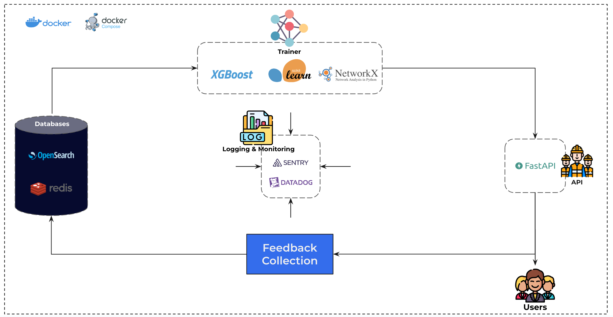

# Graph XGBoost: High speed node classification with incremental learning framework

In this project, we address the problem of predictive node classification in directed graphs, where each graph consists of nodes and edges representing directional relationships between them. Some nodes within these graphs are missing, and the objective is to develop a predictive algorithm capable of determining the types of the missing nodes based on the existing graph structure.



## How to run the cluster

Before running, make sure you have `Docker` and `docker-compose` installed, and you are in the root directory of the project, then run the following:

```bash
docker-compose build
docker-compose up
```

Optionally, you can run datadog agent for logging and monintoring with:

```
docker run --rm --name dd-agent \
-e DD_API_KEY=<YOUR-DD-API-KEY> \
-e DD_SITE="datadoghq.com" \
-e DD_APM_ENABLED=true \
-e DD_APM_NON_LOCAL_TRAFFIC=true \
-e DD_DOGSTATSD_NON_LOCAL_TRAFFIC=true \
-e DD_APM_RECEIVER_SOCKET=/opt/datadog/apm/inject/run/apm.socket \
-e DD_DOGSTATSD_SOCKET=/opt/datadog/apm/inject/run/dsd.socket \
-e DD_LOGS_ENABLED=true \
-e DD_LOGS_CONFIG_CONTAINER_COLLECT_ALL=true \
-e DD_CONTAINER_EXCLUDE_LOGS="name:datadog-agent" \
-v /opt/datadog/apm:/opt/datadog/apm \
-v /var/run/docker.sock:/var/run/docker.sock:ro \
-v /proc/:/host/proc/:ro \
-v /opt/datadog-agent/run:/opt/datadog-agent/run:rw \
-v /sys/fs/cgroup/:/host/sys/fs/cgroup:ro \
-v /var/lib/docker/containers:/var/lib/docker/containers:ro \
gcr.io/datadoghq/agent:7
```

## Using the API

Once the cluster is up and running, you have by default two replicas of the API connected to Ngnix load balancer that listens on port 80, you can change this setup in `docker-compose.yml`. You will need to add the `Api-key `provided in the `setting.json `as a header in the request. Also, you can see the API documentation by visiting the url `localhost/redoc` in your browser.

### Predicted a missing node

You can predict a missing node in a graph by sending to the `/predict` endpoint, the endpoint can perform batch of graphs, example request:

***POST localhost/predict***

```bash
{
    "graphs":[
        {
            "edges":[
                {
                    "origin_id":"X",
                    "origin_type":"N0",
                    "destination_id":"y",
                    "destination_type":"N1"
                },
                {
                    "origin_id":"Y",
                    "origin_type":"N1",
                    "destination_id":"w",
                    "destination_type":"UNK"
                }
            ]
        },
        {
            "edges":[
                {
                    "origin_id":"X",
                    "origin_type":"N0",
                    "destination_id":"y",
                    "destination_type":"N1"
                },
                {
                    "origin_id":"Y",
                    "origin_type":"N1",
                    "destination_id":"w",
                    "destination_type":"UNK"
                }
            ]
        }
    ],
    "track": false
}
```

The above request will return the following:

```bash
{
    "results": [
        "N31",
        "N31"
    ]
}
```

### Tracking and Feedback system

You can track your requests by setting the `track` field value in your request to  `true`, this will result in new field `track` in the response with list of IDs correspond to each input graph, you can use the IDs accordingly to provide feedback to the system by sending the graph with the right answer to the `rate` endpoint. Full example:

***POST localhost/predict***

```bash
{
    "graphs":[
        {
            "edges":[
                {
                    "origin_id":"X",
                    "origin_type":"N0",
                    "destination_id":"y",
                    "destination_type":"N1"
                },
                {
                    "origin_id":"Y",
                    "origin_type":"N1",
                    "destination_id":"w",
                    "destination_type":"UNK"
                }
            ]
        },
        {
            "edges":[
                {
                    "origin_id":"X",
                    "origin_type":"N0",
                    "destination_id":"y",
                    "destination_type":"N1"
                },
                {
                    "origin_id":"Y",
                    "origin_type":"N1",
                    "destination_id":"w",
                    "destination_type":"UNK"
                }
            ]
        }
    ],
    "track": true
}
```

Response:

```bash
{
    "results": [
        "N15",
        "N15"
    ],
    "track": [
        "feae5b22-f53c-4c3c-8dc7-e32fd99b2698",
        "5c817514-fa64-4eec-afdf-5686ba1770c6"
    ]
}
```

Now once you have the track IDs, you can send feedback with maximum of 10 minutes to `rate`:

**POST localhost/rate**

```bash
{
    "ratings":[
        {
            "id":"feae5b22-f53c-4c3c-8dc7-e32fd99b2698",
            "label":"N1"
        }
    ]
}
```

Response: 200 OK

At this point, the cached result will be automatically corrected if it was incorrect and stored in the database for incremental training.


## Extras

### Mock testing of incremental learning

In order to test if incremental learning works, you can take a look at the logs, you will probably notice a log indicating that the training is failing to start because of low number of data points

```bash
No training session will start for track ID:8d36a247-7da9-4859-b604-a11895234f34, not enough data.
```

Trainer stores the last time it was trained, and calculates the total number of new incoming feedback, if it exceeds 1000 graphs, training will start, a point to keep in mind that you need to have in opensearch index the original data that the model was trained on in the first runs, as it does full re-training of the model.

To test if the model re-training works, you can run the script in `extras/trigger_fake_training.py` which adds fake data in `.cache/random.parquet` in opensearch that results in triggering the pipeline, make sure to clear the cluster after testing to not use a model trained on random fake data by:

```bash
docker-compose down
docker container prune
docker-compose up
```

You should see the following logs that indicates that the training is runing:

```bash
2024-01-19 00:07:14,914 - DEBUG - trainer.main.py - New training session with track ID:1ffd5c36-6e4a-4f88-aa83-96157c6fc20a has started.
2024-01-19 00:09:16,768 - DEBUG - trainer.main.py - Preprocessing of training session with track ID:1ffd5c36-6e4a-4f88-aa83-96157c6fc20a is done, starting training.
...

```
